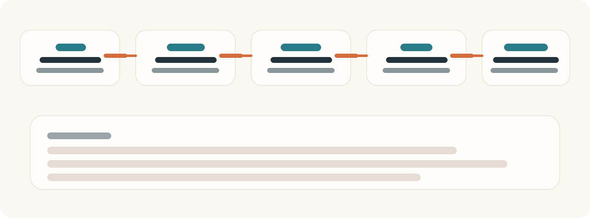
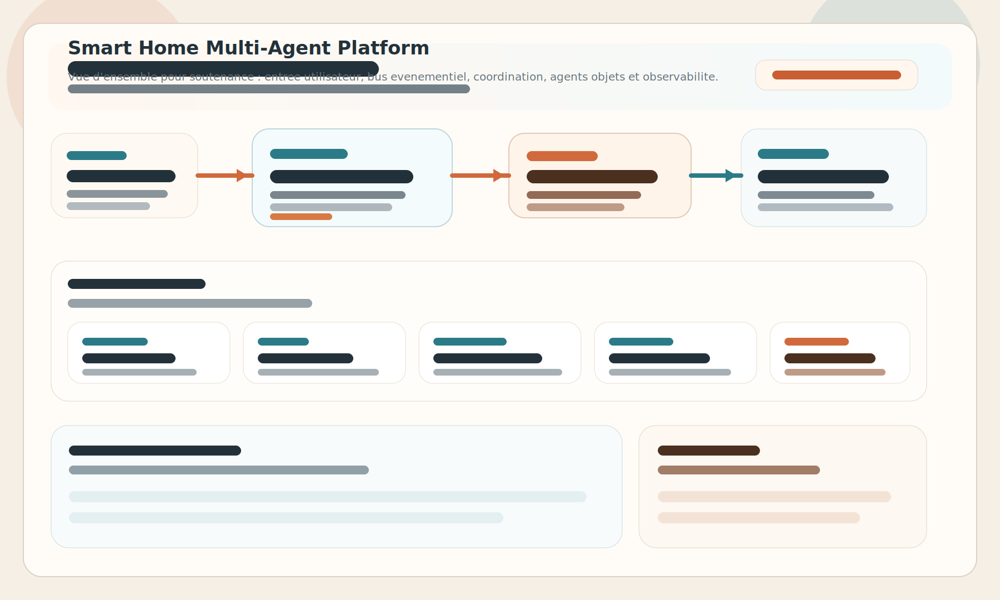
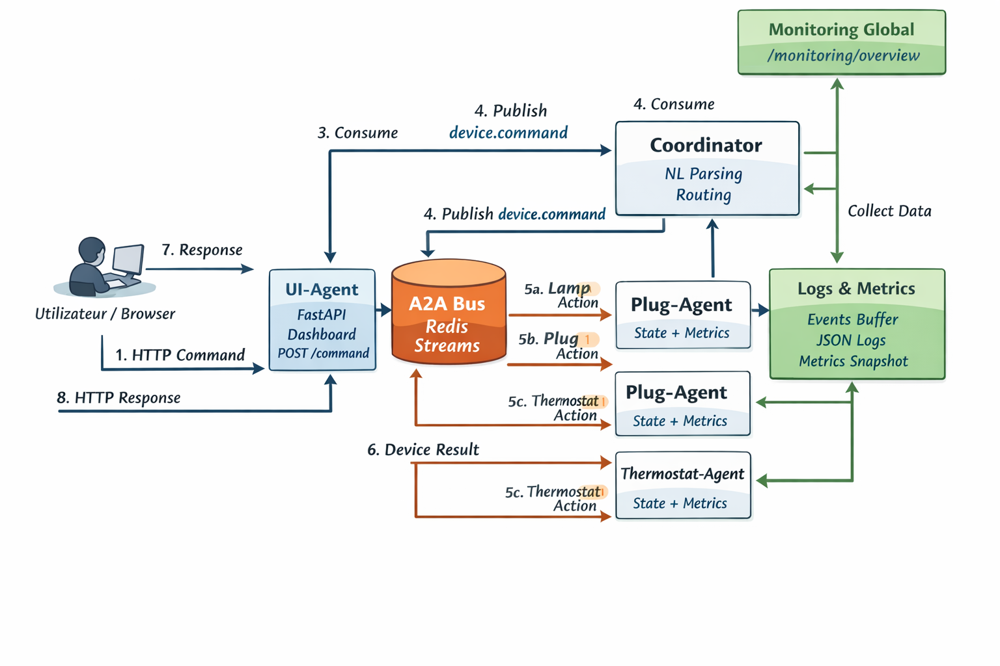

# Smart Home Multi-Agent Platform

[](https://github.com/<your-user>/<your-repo>/actions/workflows/ci.yml)


Plateforme de domotique pedagogique basee sur une architecture micro-services. Chaque objet connecte est simule par un service FastAPI, les commandes transitent via Redis Streams, et un `ui-agent` expose a la fois une API simple et un dashboard web de supervision.

## Points forts

- Dashboard web accessible sur `http://localhost:8010`
- Commandes en langage naturel via `POST /command`
- Monitoring JSON via `/metrics` et `/monitoring/overview`
- Logs structures et evenements recents sur chaque service
- Stack Docker Compose simple a lancer et facile a montrer en demo

## Architecture

Services principaux :

- `redis` : bus d'evenements Redis Streams
- `ui-agent` : API HTTP + dashboard web + vue d'ensemble monitoring
- `coordinator` : parsing et routage vers le bon agent
- `lamp-agent` : simulation de lampe
- `plug-agent` : simulation de prise
- `thermostat-agent` : simulation de thermostat

Les messages suivent un contrat commun :

```json
{
  "schema_version": "1.0",
  "msg_id": "uuid",
  "trace_id": "uuid",
  "from": "ui-agent",
  "to": "coordinator",
  "topic": "nl.command",
  "content": {
    "text": "allume la lampe du salon",
    "reply_to": "ui-agent"
  },
  "ts": "2026-04-06T10:00:00+00:00"
}
```

Plus de details : [ARCHITECTURE.md](./ARCHITECTURE.md)
Schema visuel : [docs/ARCHITECTURE-DIAGRAM.md](./docs/ARCHITECTURE-DIAGRAM.md)
Schemas de soutenance : [docs/C4-SIMPLIFIED.md](./docs/C4-SIMPLIFIED.md) et [docs/TECHNICAL-DATAFLOW.md](./docs/TECHNICAL-DATAFLOW.md)

## Lancement local

```bash
docker compose up --build
```

Services exposes :

- `http://localhost:8010` : dashboard + API `ui-agent`
- `http://localhost:8020/healthz` : coordinator
- `http://localhost:8031/state` : lampe
- `http://localhost:8032/state` : prise
- `http://localhost:8033/state` : thermostat

## Utilisation rapide

Exemple de commande :

```bash
curl -X POST http://localhost:8010/command \
  -H "Content-Type: application/json" \
  -d '{"text":"allume la lampe du salon"}'
```

Exemples couverts par le projet :

1. Allumer une lampe
2. Eteindre une prise
3. Lire l'etat du thermostat
4. Regler le thermostat a `23C`

## Dashboard et monitoring

Le dashboard principal affiche :

- l'etat de sante des services
- l'etat des objets connectes
- les compteurs de messages publies/consommes
- les evenements recents
- les logs recents

Endpoints utiles :

- `GET /` sur `ui-agent` : interface web
- `GET /dashboard/data` : donnees agregees du dashboard
- `GET /monitoring/overview` : monitoring JSON global
- `GET /metrics` : metriques d'un service
- `GET /dump` : messages et evenements recents

## Captures d'ecran

Preview dashboard :


Vue architecture / flux :



Schema visuel pour soutenance :



Schema technique du projet fourni :



Pour remplacer ces apercus par de vraies captures PNG ou un GIF, utilisez le guide dans [docs/DEMO.md](./docs/DEMO.md).

## Demo GIF / video

Le depot est pret pour une demo GitHub courte :

- ouvrez le dashboard sur `http://localhost:8010`
- lancez une commande naturelle
- montrez le changement d'etat des objets
- terminez sur les logs et le monitoring global

Script conseille et noms de fichiers media : [docs/DEMO.md](./docs/DEMO.md)

## Tests

Le test bout-en-bout du projet est fourni dans [`test.ps1`](./test.ps1) :

```powershell
./test.ps1
```

Il verifie :

- le demarrage Docker
- la disponibilite de chaque service
- les 4 scenarios fonctionnels principaux

## Structure

```text
smart_home/
  common/
  coordinator/
  lamp_agent/
  plug_agent/
  thermostat_agent/
  ui_agent/
.github/
  workflows/
test.ps1
docker-compose.yml
```


