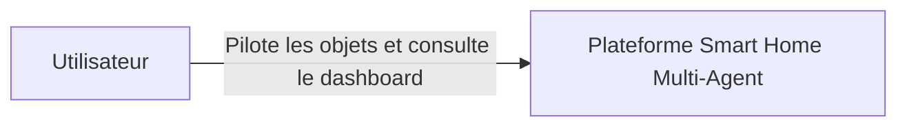
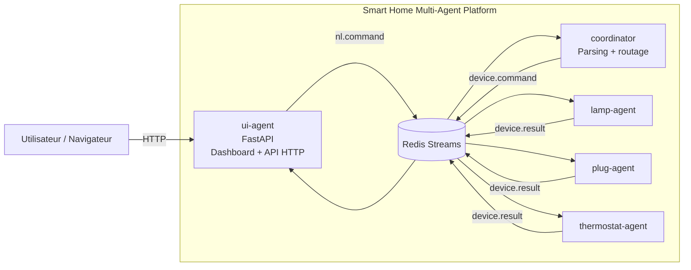
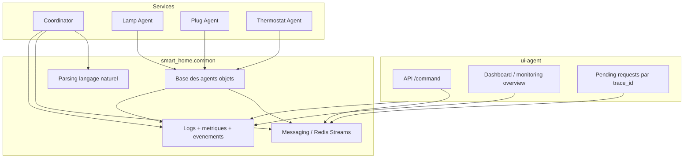

# Schema C4 simplifie

Ce document propose une vue C4 simplifiee du projet pour une soutenance ou une lecture rapide sur GitHub.

## Niveau 1 : Contexte

## Niveau 2 : Conteneurs

## Niveau 3 : Composants logiques

## Lecture rapide

- Niveau 1 : l'utilisateur interagit avec une seule plateforme.
- Niveau 2 : la plateforme est composee de 5 conteneurs applicatifs et d'un bus Redis.
- Niveau 3 : la logique reutilisable est mutualisee dans `smart_home.common`.
