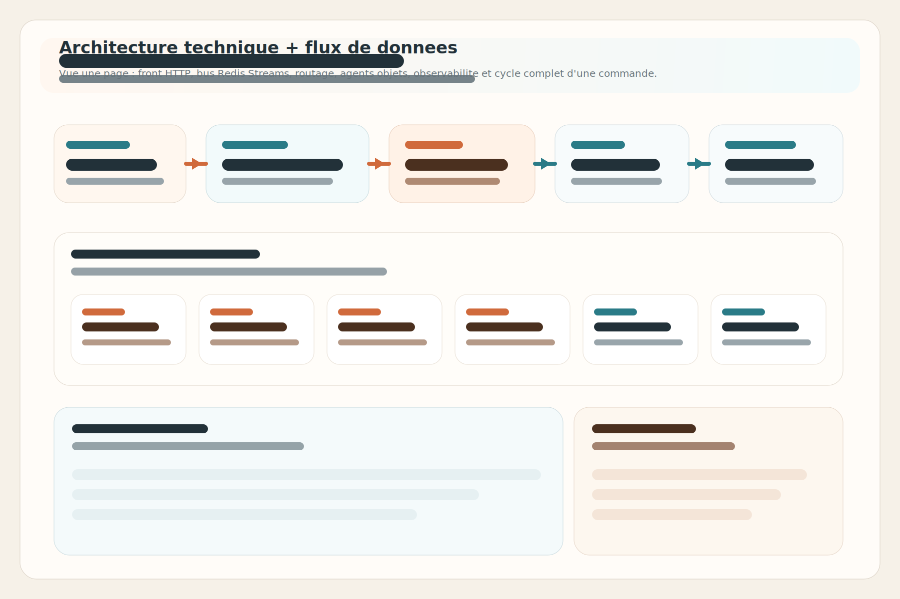
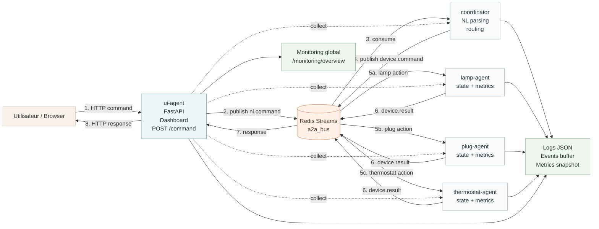

# Architecture technique et flux de donnees

Ce schema rassemble la vue technique et le parcours d'une commande sur une seule page.

## Schema principal

Image de reference du projet :

Version SVG alternative du depot :

## Parcours d'une commande

1. L'utilisateur envoie une commande HTTP au `ui-agent`.
2. Le `ui-agent` publie un message `nl.command` dans Redis Streams.
3. Le `coordinator` lit ce message et interprete l'intention.
4. Le `coordinator` publie une commande structuree `device.command`.
5. L'agent cible applique l'action.
6. L'agent publie un `device.result`.
7. Le `ui-agent` recupere la reponse.
8. Le resultat est retourne au client et visible dans le dashboard.
